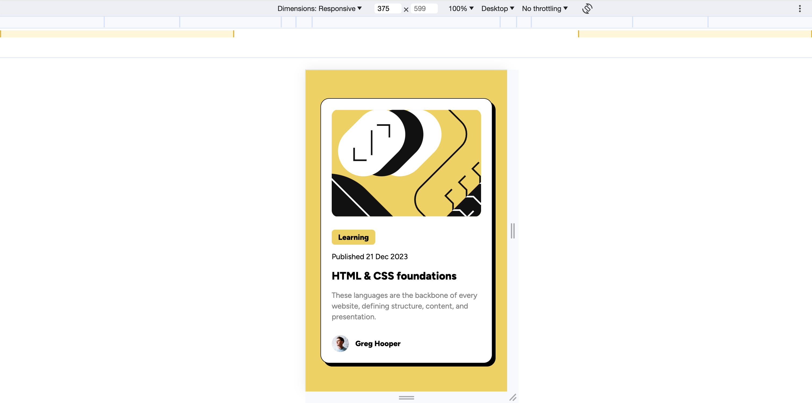
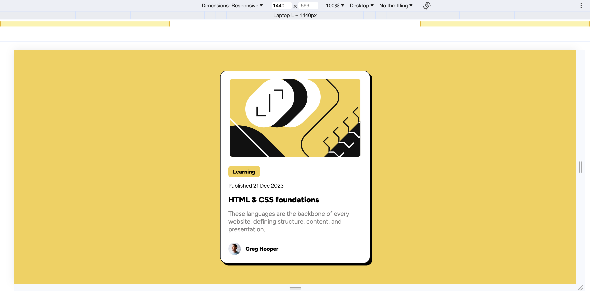

# Frontend Mentor - Blog preview card solution

This is a solution to the [Blog preview card challenge on Frontend Mentor](https://www.frontendmentor.io/challenges/blog-preview-card-ckPaj01IcS). Frontend Mentor challenges help you improve your coding skills by building realistic projects.

## Table of contents

- [Overview](#overview)
  - [The challenge](#the-challenge)
  - [Screenshot](#screenshot)
  - [Links](#links)
- [My process](#my-process)
  - [Built with](#built-with)
  - [What I learned](#what-i-learned)
- [Author](#author)

## Overview

### The challenge

Users should be able to:

- See hover and focus states for all interactive elements on the page

### Screenshot

- Mobile

- Desktop

### Links

- Solution URL: [Frontend Mentor](https://www.frontendmentor.io/solutions/tailwind-built-blog-preview-card-pemllTywJC)
- Live Site URL: [GitHub Pages](https://btjl.github.io/blog-preview-card/)

## My process

### Built with

- Semantic HTML5 markup
- Flexbox
- Mobile-first workflow
- [React](https://reactjs.org/) - JS library
- [TailwindCSS](https://tailwindcss.com/) - For styles

### What I learned

- How to configure `tailwindcss` to make a custom drop-shadow
- Scaling an image using `tailwindcss`

## Author

- Website - [Brennan](https://btjl.vercel.app/)
- Frontend Mentor - [@btjl](https://www.frontendmentor.io/profile/btjl)
